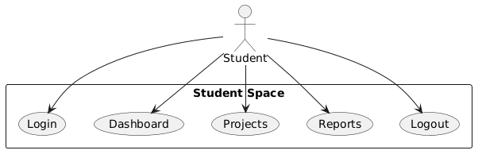
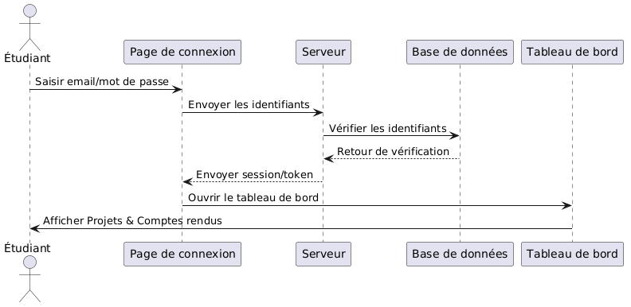
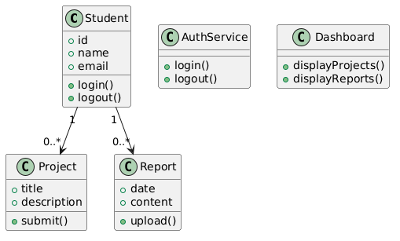

# US1 – Access Student Space

## Description
En tant qu'étudiant, je peux accéder à mon espace via mon email professionnel afin de soumettre mes propositions de projet et suivre mes comptes rendus.

## Tasks
- Développement interface login
- Authentification sécurisée (JWT / session)
- Dashboard étudiant
- Affichage projets soumis
- Affichage comptes rendus et logout

## Diagrammes
- 
- 
- 